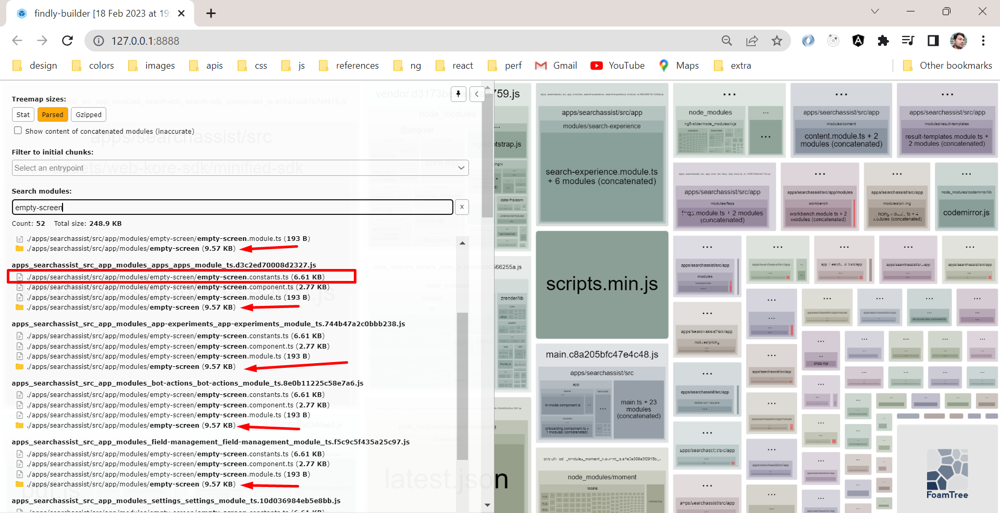

# Lazy load translation files



## How to use lazy translations ?

https://github.com/ngx-translate/core/issues/1193#issuecomment-1435670125

## Resources

https://phrase.com/blog/posts/angular-i18n-ngx-translate/

# Guide

# Setup

```
npm install @ngx-translate/core
npm install @ngx-translate/http-loader
```

## Root Setup

```js
// app.module.ts
export function createTranslateLoader(http: HttpClient) {
  return new TranslateHttpLoader(http, './assets/i18n/', '.json');
}

TranslateModule.forRoot({
  defaultLanguage: 'en',
  loader: {
    provide: TranslateLoader,
    useFactory: createTranslateLoader,
    deps: [HttpClient],
  },
  extend: true,
}),
```

## In lazy module

```js

```
